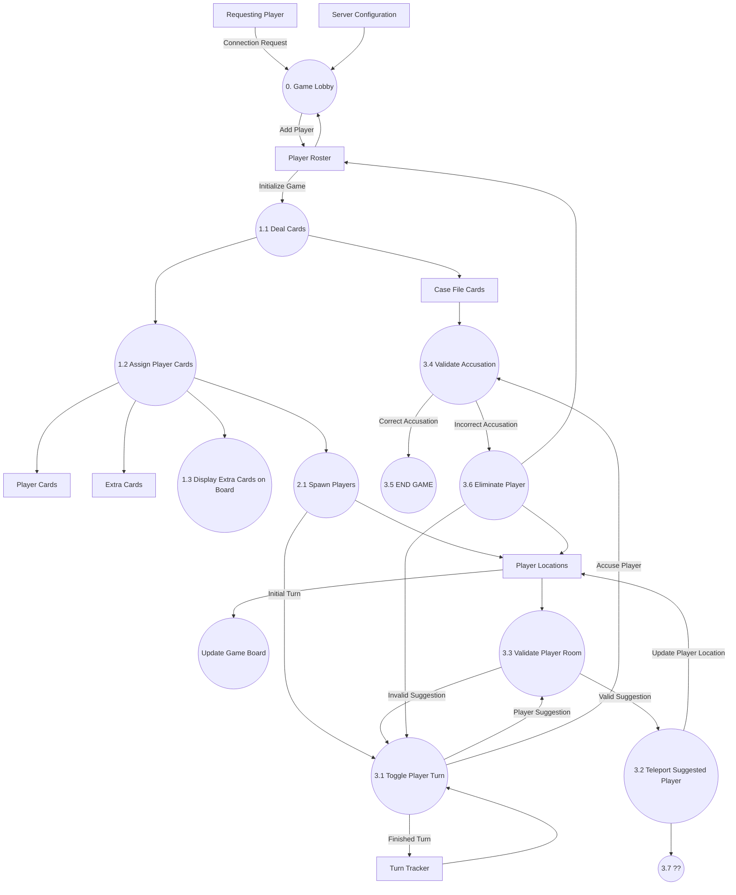

```mermaid

graph TD

RP[Requesting Player] --> | Connection Request | 0((0. Game Lobby))
0 --> | Add Player | PR[Player Roster]
PR --> 0
SC[Server Configuration] --> 0
PR --> | Initialize Game | 1.1((1.1 Deal Cards))
1.1 --> CF[Case File Cards]
1.1 --> 1.2((1.2 Assign Player Cards))
1.2 --> PC[Player Cards]
1.2 --> EC[Extra Cards]
1.2 --> 1.3((1.3 Display Extra Cards on Board))
1.2 --> 2.1((2.1 Spawn Players))
2.1 --> PL[Player Locations]
PL --> 2.2((Update Game Board)) 
2.1 --> | Initial Turn |3.1((3.1 Toggle Player Turn))
3.1 --> | Finished Turn | TT[Turn Tracker]
TT --> 3.1

3.1 --> | Player Suggestion | 3.3((3.3 Validate Player Room))
PL --> 3.3
3.3 --> | Invalid Suggestion | 3.1
3.3 --> | Valid Suggestion | 3.2((3.2 Teleport Suggested Player))
3.2 --> | Update Player Location | PL
3.2 --> 3.7((3.7 ??))

3.1 --> | Accuse Player | 3.4((3.4 Validate Accusation))
CF --> 3.4
3.4 --> | Correct Accusation | 3.5((3.5 END GAME))
3.4 --> | Incorrect Accusation | 3.6((3.6 Eliminate Player))
3.6 --> PR
3.6 --> PL
3.6 --> 3.1


```