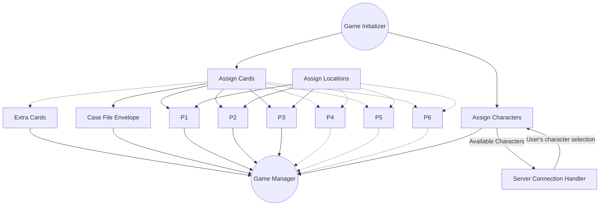

```mermaid

graph TD

GI((Game Initializer)) --> AC[Assign Cards]
GI --> ACH[Assign Characters]
AC --> CF[Case File Envelope]
AC --> P1
AC --> P2
AC --> P3
AC -.-> P4
AC -.-> P5
AC -.-> P6
AL[Assign Locations] --> P1
AL --> P2
AL --> P3
AL -.-> P4
AL -.-> P5
AL -.-> P6

AC -.-> EC[Extra Cards]
EC --> GM


CF --> GM((Game Manager))
P1 --> GM
P2 --> GM
P3 --> GM
P4 -.-> GM
P5 -.-> GM
P6 -.-> GM
ACH --> GM

SCH[Server Connection Handler] --> | User's character selection |ACH
ACH --> | Available Characters | SCH
```