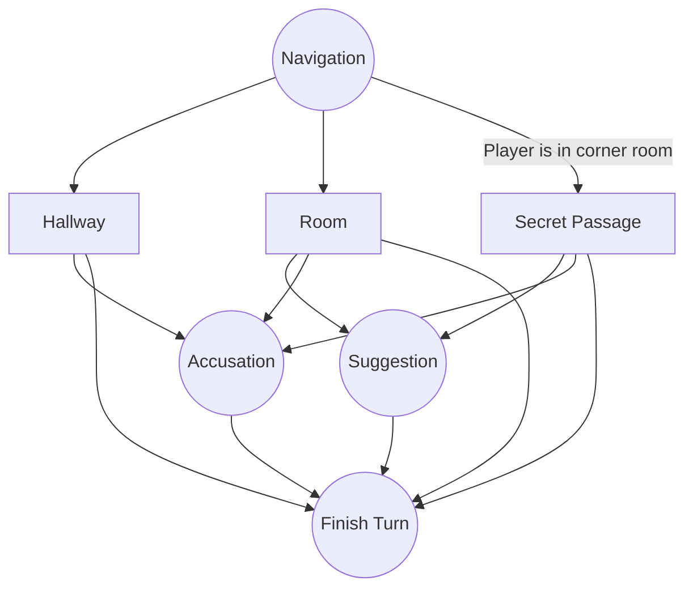

```mermaid

graph TD

N((Navigation)) --> H[Hallway]
N --> R[Room]
N --> |Player is in corner room| SP[Secret Passage]

S((Suggestion))
A((Accusation))

H --> A((Accusation))
R --> S
R --> A
SP --> S
SP --> A

F((Finish Turn))

R --> F
H --> F
SP --> F
S --> F
A --> F

```