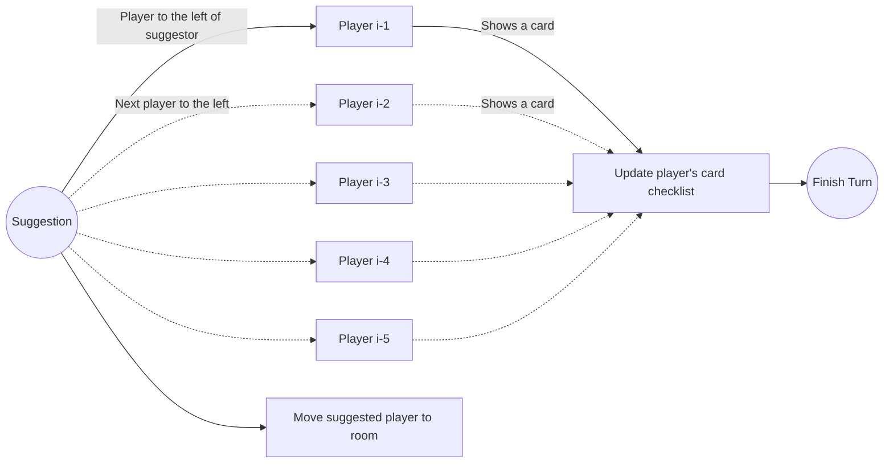

```mermaid

graph LR

S((Suggestion)) --> |Player to the left of suggestor|PL1[Player i-1]
S((Suggestion)) -. Next player to the left.-> PL2[Player i-2]
S((Suggestion)) -.-> PL3[Player i-3]
S((Suggestion)) -.-> PL4[Player i-4]
S((Suggestion)) -.-> PL5[Player i-5]

S --> MP[Move suggested player to room]

PL1 --> |Shows a card|U[Update player's card checklist]
PL2 -.-> |Shows a card|U[Update player's card checklist]
PL3 -.-> U[Update player's card checklist]
PL4 -.-> U[Update player's card checklist]
PL5 -.-> U[Update player's card checklist]
U --> F((Finish Turn))
```