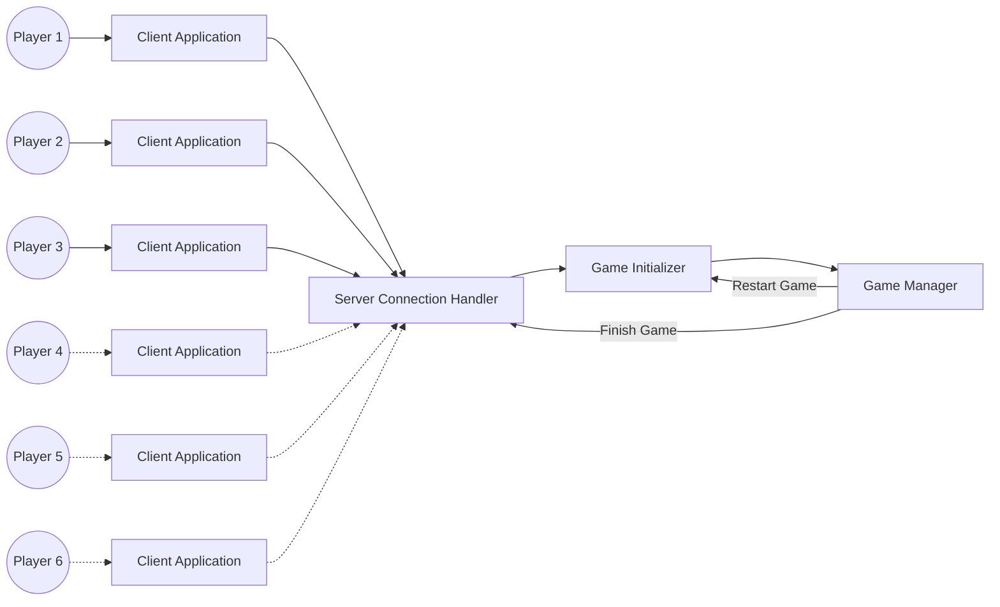

```mermaid

graph LR

P1((Player 1)) --> CP1[Client Application]
P2((Player 2)) --> CP2[Client Application]
P3((Player 3)) --> CP3[Client Application]
P4((Player 4)) -.-> CP4[Client Application]
P5((Player 5)) -.-> CP5[Client Application]
P6((Player 6)) -.-> CP6[Client Application]

CP1 --> CH[Server Connection Handler]
CP2 --> CH[Server Connection Handler]
CP3 --> CH[Server Connection Handler]
CP4 -.-> CH[Server Connection Handler]
CP5 -.-> CH[Server Connection Handler]
CP6 -.-> CH[Server Connection Handler]

CH --> GI[Game Initializer]
GI --> GM[Game Manager]
GM --> | Restart Game | GI
GM --> | Finish Game | CH
```